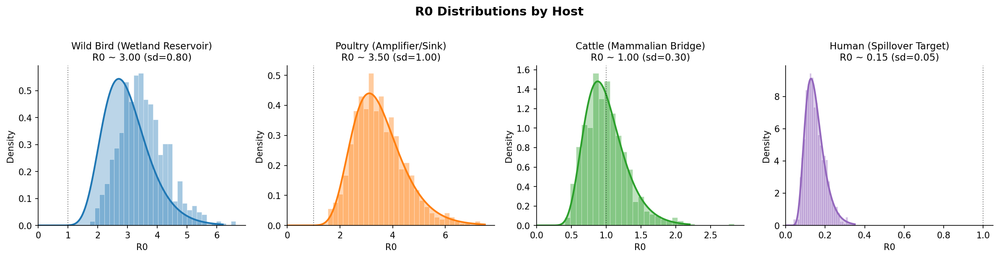
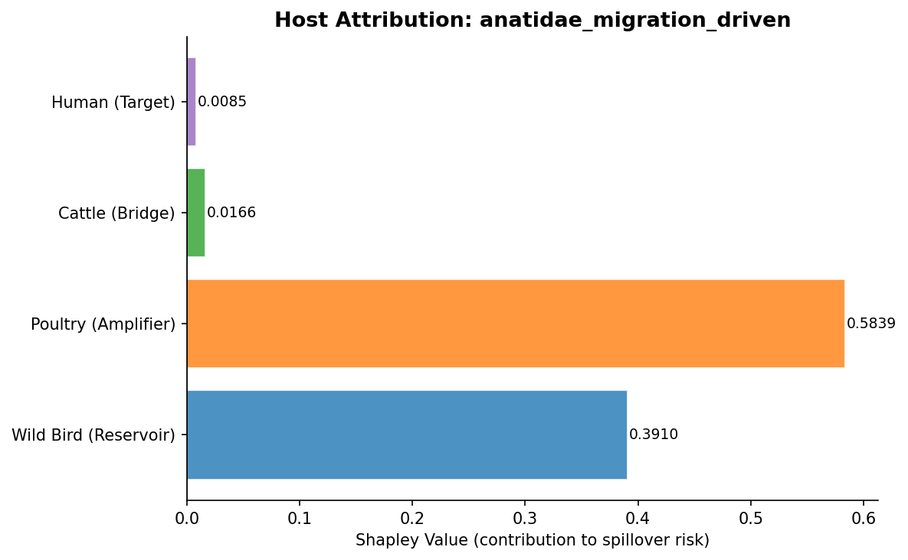
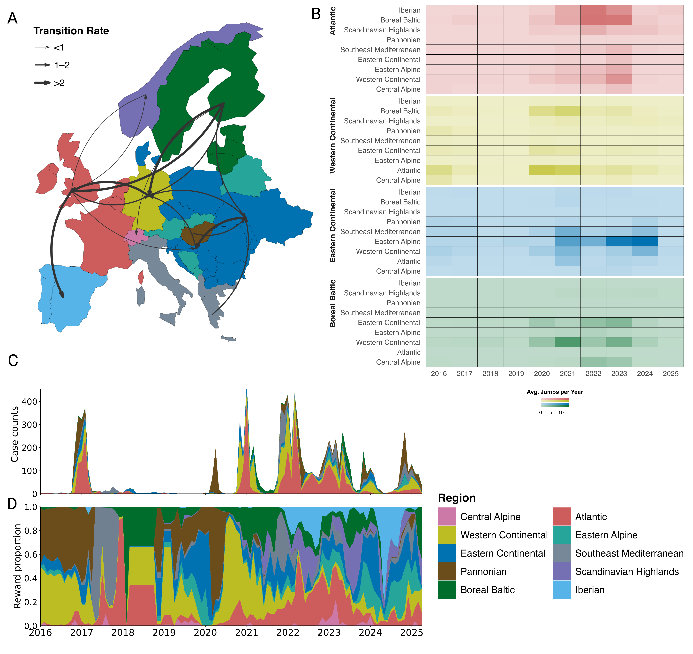
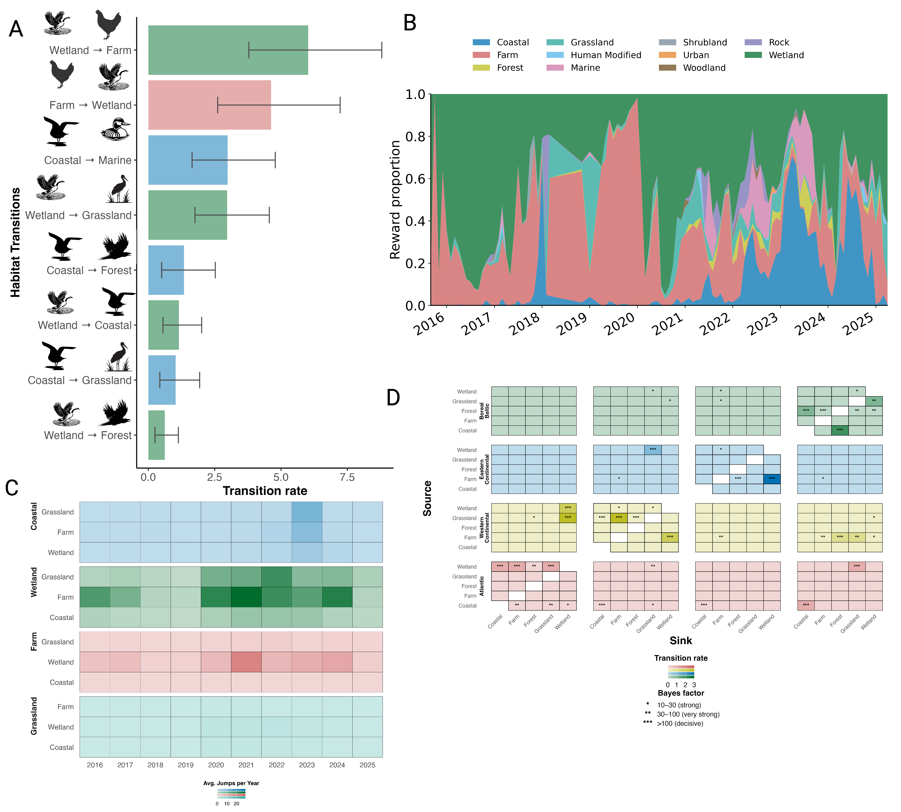
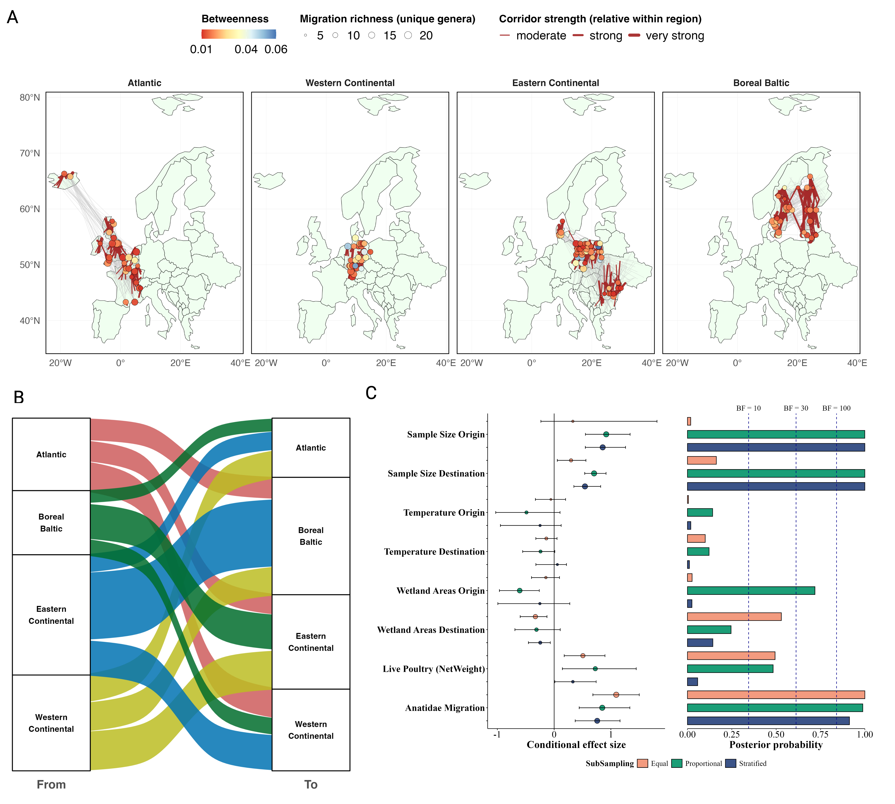

# PhD Projects

## 1. PhyloSpillover: Graph Neural Network-Based Prediction of Pre-Emergence Zoonotic Spillover Risk from Avian Influenza H5N1 Using Multi-Host Phylodynamic Simulations

**](images/baseline_comparison-01.png)

The emergence of highly pathogenic avian influenza (HPAI) H5N1 in mammals, including recent incursions into North American dairy cattle, has heightened pandemic concerns. Traditional surveillance detects human-to-human transmission only after establishment. Predicting phylodynamic signatures that precede sustained transmission could enable earlier warning. We developed PhyloSpillover-Sim, integrating mechanistic multi-host birth-death models with graph neural networks (GNNs). We simulated 8,553 phylogenetic trees across 12 epidemiological scenarios grounded in European H5N1 clade 2.3.4.4b surveillance. Trees were encoded as graphs with 37-dimensional node features spanning host identity, within-host R0, 22 genomic adaptation markers (including PB2-E627K and HA receptor-binding mutations), and spatial risk. An Epidemiologically-Informed Neural Network with mechanistic constraints and Model-Agnostic Meta-Learning achieved R² = 0.869, RMSE = 0.033, and Spearman ρ = 0.835 (p \< 10⁻¹⁰) on held-out data (n = 2,113), outperforming mean predictors (R² = -0.020) and approaching Random Forest (R² = 0.946). Removing genomic features reduced R² by 7%, and Shapley analysis identified poultry as the dominant risk contributor in all scenarios. The near-threshold scenario produced 16-fold more human spillover events than baseline, while meta-learning enabled adaptation from 5 examples. Phylodynamic tree structure encodes predictive information for pre-emergence spillover risk, offering interpretable early warning for pandemic preparedness.

## 2. **Ecological and Evolutionary Drivers of 2.3.4.4b H5Nx HPAI Spread in Europe**

](images/ComBio2-01.png)

Highly pathogenic avian influenza (HPAI) H5Nx clade 2.3.4.4b has been circulating in Europe since 2016, posing a threat to poultry, wildlife, and public health. However, the determinants of viral spillover, spread, and annual emergence remain poorly understood. Here, we integrated genomic, ecological, and epidemiological data from 2016 to 2025 within a comparative phylogeographic framework to quantify viral spread among regions and habitats. We analyzed 7,031 European H5Nx HA sequences, integrating habitat trait data from AVONET. Geographic strata were defined by hierarchical clustering cross-classified with European Environment Agency biogeographic regions, yielding ten ecologically and geographically grounded regional strata. Three subsampling strategies yielded nine datasets. We found that the Atlantic region served as a persistent reservoir for the long-term circulation of H5Nx viruses. The Western Continental region was a key secondary hub that structured cross-regional transmission. Wetlands formed the backbone of transmission, repeatedly seeding farms, grasslands, and coastal areas. Anatidae migration was the most robust predictor of inter-regional transmission, with live-poultry trade contributing to a secondary, sampling-dependent signal. Together, these findings demonstrate that regional transmission hubs and persistent wetland reservoirs shape European H5Nx dynamics. These dynamics highlight waterfowl migratory connectivity and trade corridors as priorities for surveillance and control.

# MS Projects

## 1. Monitoring Cage-free Hens’ Pecking with Deep Learning

This project focuses on leveraging deep learning models to monitor and analyze pecking behavior in cage-free hens, aiming to improve poultry welfare and reduce economic losses through precision farming techniques. By utilizing advanced machine vision methods, we developed a system capable of detecting pecking behavior with high precision, offering insights into the social dynamics and welfare of hens in a cage-free environment.

{width="100%"}

For more information, visit [Monitoring Cage-free Hens' Pecking with Deep Learning](https://site.caes.uga.edu/precisionpoultry/2023/01/monitoring-cage-free-hens-pecking-with-deep-learning/).

## 2. Tracking Floor Eggs in Cage-free Houses with Machine Vision Technologies

This project introduces a novel approach to addressing the challenge of floor eggs in cage-free hen houses using machine vision technologies. By developing and comparing three new deep learning models (YOLOv5s-egg, YOLOv5x-egg, and YOLOv7-egg), the study achieved high precision in detecting floor eggs, which are prone to contamination and difficult to collect manually. This advancement not only improves efficiency in egg production but also sets the stage for further innovations in precision poultry farming, including the potential for automated egg collection systems.

{width="100%"} {width="100%"}

For more details, visit the [Tracking Floor Eggs in Cage-free Houses with Machine Vision Technologies](https://site.caes.uga.edu/precisionpoultry/2023/03/tracking-floor-eggs-in-cage-free-houses-with-machine-vision-technologies/).

## 3. Multiple Behavior Classification of Cage-Free Laying Hens Using Deep Learning

This study presents the development of three deep learning models (YOLOv5s_BH, YOLOv5x_BH, and YOLOv7_BH) aimed at classifying multiple behaviors of cage-free laying hens, enhancing the welfare and management of poultry production. By utilizing a comprehensive dataset and the advanced YOLO (You Only Look Once) technology, the research achieved significant precision in behavior detection, contributing to precision poultry farming advancements. This project underscores the potential of machine vision technologies in automating and improving animal welfare monitoring in agricultural practices.

{width="100%"} {width="100%"} ---
